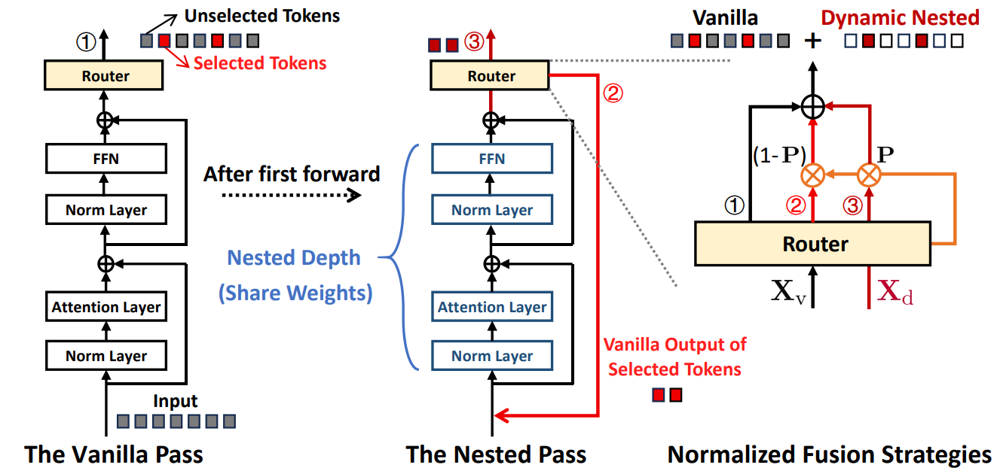

## 👋 About Me

Hello! I am **Xiaodong Chen**, currently a second-year M.S. student at **Renmin University of China**, **School of Information**, where I am advised by Prof. **[Jing Zhang](https://xiaojingzi.github.io/)**. During my M.S. studies, I have authored **6 papers**, with **3 as first author**, published at top-tier venues including **ACL** and **ICLR**.

Prior to this, I completed my B.Eng. degree at **Xi'an Jiaotong University**, **School of Computer Science and Technology** (2020–2024), graduating **1st out of 33** in my cohort.

I previously worked as a Research Intern at the **AGI Center, Ant Research Institute** (Mar. 2025 – Oct. 2025), supervised by [Jianguo Li](https://sites.google.com/site/leeplus/) and [Haoxing Chen](https://chenhaoxing.github.io/).

Most recently, I interned with the **GLM Foundation Model Group** at **Zhipu AI** (Nov. 2025 – Apr. 2026), working under the guidance of [Zhengxiao Du](https://zxdu.xyz/).

---

## 🔬 Research Interests

My research focuses on:

- 🏗️ **Model Architecture**
- ✂️ **Model Compression**
- ⚡ **Speculative Decoding**

📫 Feel free to reach out via email:  
**[chenxiaodong@ruc.edu.cn](mailto:chenxiaodong@ruc.edu.cn)**

---

## 🥇 Honors and Awards

- **China National Scholarship** (2025) — *Top 1%*
- **Renmin University of China Academic Excellence Scholarship — First Prize** (2025) — *Top 5%*
- **Renmin University of China Academic Excellence Scholarship — First Prize** (2024) — *Top 5%*
- **Xi'an Jiaotong University Academic Scholarship — First Prize** (2022) — *Top 5%*

---

## 📝 First-Author Publications

<table style="width:100%;border:0px;border-spacing:0px;border-collapse:separate;margin-right:auto;margin-left:auto;">

  <!-- Paper 1: ICLR 2025 -->
  <tr>
    <td style="padding:20px;width:30%;vertical-align:middle">
      
    </td>
    <td style="padding:20px;width:70%;vertical-align:middle">
      <a href="https://openreview.net/forum?id=IC5RJvRoMp">
        Streamlining Redundant Layers to Compress Large Language Models
      </a>
       
      <strong>Xiaodong Chen</strong>, Yuxuan Hu, Jing Zhang, Yanling Wang, Cuiping Li, Hong Chen
       
      <em>International Conference on Learning Representations (ICLR), 2025</em> (Spotlight)
       
      
      
    </td>
  </tr>
  
  <!-- Paper 2: ACL 2025 -->
  <tr>
    <td style="padding:20px;width:30%;vertical-align:middle">
      
    </td>
    <td style="padding:20px;width:70%;vertical-align:middle">
      <a href="https://aclanthology.org/2025.acl-long.283/">
        P2 Law: Scaling Law for Post-Training After Model Pruning
      </a>
       
      <strong>Xiaodong Chen</strong>, Yuxuan Hu, Xiaokang Zhang, Yanling Wang, Cuiping Li, Hong Chen, Jing Zhang
       
      <em>Annual Meeting of the Association for Computational Linguistics (ACL), 2025</em>
       
      
    </td>
  </tr>
  
  <!-- Paper 3: ICLR 2026 -->
  <tr>
    <td style="padding:20px;width:30%;vertical-align:middle">
      
    </td>
    <td style="padding:20px;width:70%;vertical-align:middle">
      <a href="https://arxiv.org/abs/2508.05257">
        MoBE: Mixture-of-Basis-Experts for Compressing MoE-based LLMs
      </a>
       
      <strong>Xiaodong Chen</strong>, Mingming Ha, Zhenzhong Lan, Jing Zhang, Jianguo Li
       
      <em>International Conference on Learning Representations (ICLR), 2026</em>
       
      
      
    </td>
  </tr>

  <!-- Paper 4: ICLR 2026 -->
  <tr>
    <td style="padding:20px;width:30%;vertical-align:middle">
      
    </td>
    <td style="padding:20px;width:70%;vertical-align:middle">
      <a href="https://arxiv.org/abs/2510.11001">
        DND: Boosting Large Language Models with Dynamic Nested Depth
      </a>
       
      Tieyuan Chen, <strong>Xiaodong Chen</strong>, Haoxing Chen, Zhenzhong Lan, Weiyao Lin, Jianguo Li
       
      <em>International Conference on Learning Representations (ICLR), 2026</em>
       
      
    </td>
  </tr>
</table>

---
